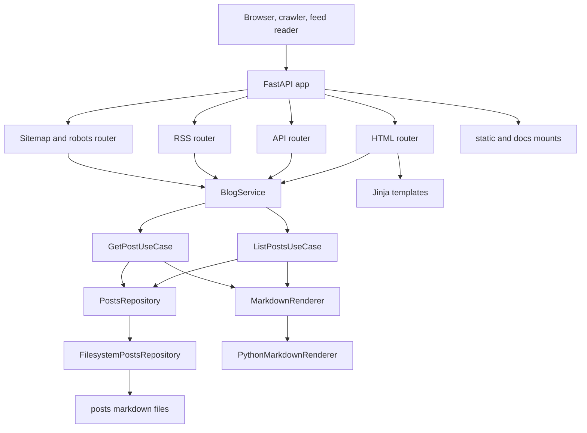

# Architecture

CrankTheCode is a small FastAPI application that serves a personal site (blog plus portfolio) from Markdown posts.

## What runs in production

- ASGI app factory: [`create_app()`](app/main.py:18)
- Canonical host and scheme enforcement: [`enforce_canonical_host_and_scheme()`](app/main.py:36)
- Render entrypoint module exposes `app`: [`main.py`](main.py:1)

## High level shape

The codebase is intentionally simple and uses a light Ports and Adapters layout.

- Presentation: FastAPI routers for HTML pages and the JSON API
- Application: a small service façade plus use cases
- Infrastructure: filesystem backed post repository plus a Python Markdown renderer

Key types:

- Service façade: [`BlogService`](app/services/blog_service.py:12)
- Use cases: [`ListPostsUseCase.execute()`](app/usecases/list_posts.py:106) and [`GetPostUseCase.execute()`](app/usecases/get_post.py:180)
- Storage adapter: [`FilesystemPostsRepository`](app/adapters/filesystem_posts_repository.py:16)
- Rendering adapter: [`PythonMarkdownRenderer`](app/adapters/markdown_python_renderer.py:11)

## Request flows

### Homepage

- Route handler: [`homepage()`](app/http/routers/html.py:576)
- Shared request context (canonical URL, query state, defaults): [`_base_context()`](app/http/routers/html.py:488)

### Posts index

- Route handler: [`posts_index()`](app/http/routers/html.py:669)
- Default behaviour hides blog posts unless explicitly included via `exclude_blog=0`: [`_base_context()`](app/http/routers/html.py:488)

### Post detail

- Route handler: [`read_post()`](app/http/routers/html.py:962)
- Content is produced by the application layer: [`GetPostUseCase.execute()`](app/usecases/get_post.py:180)
- Canonical URL is computed per request: [`canonical_url_for_request()`](app/http/seo.py:42)
- Meta description is built from frontmatter (blurb then one liner): [`build_meta_description()`](app/http/seo.py:54)
- JSON-LD is emitted by the base template in two slots: [`templates/base.html`](templates/base.html:76)

### RSS, sitemap and robots

- RSS feed: [`rss_feed()`](app/http/routers/rss.py:149)
- Sitemap: [`sitemap_xml()`](app/http/routers/sitemap.py:17)
- Robots: [`robots_txt()`](app/http/routers/sitemap.py:51)

## Content model and authoring contract

Posts are `*.md` files with YAML frontmatter loaded via the filesystem repository.

- Tags are normalized to a list of strings: [`FilesystemPostsRepository._normalize_tags()`](app/adapters/filesystem_posts_repository.py:34)
- Dates are normalized to a stable sortable string: [`FilesystemPostsRepository._normalize_published_at()`](app/adapters/filesystem_posts_repository.py:141)

Tags appear in both page UI and structured data.

- UI tags display on post pages: [`templates/post.html`](templates/post.html:13)
- JSON-LD keywords are a comma joined rendering of tags: [`jsonld["keywords"]`](app/http/routers/html.py:1063)

## Templates and assets

- Base HTML layout and SEO meta slots: [`templates/base.html`](templates/base.html:1)
- Post detail template: [`templates/post.html`](templates/post.html:1)
- Static files are mounted by the app factory: [`create_app()`](app/main.py:18)
- `robots.txt` is sourced from a static file and rewritten with the correct sitemap URL: [`static/robots.txt`](static/robots.txt:1)

## Tests

- SEO regression net checks canonical, description and parseable JSON-LD for every post: [`test_all_posts_have_required_seo_meta_and_valid_jsonld()`](tests/test_seo.py:208)
