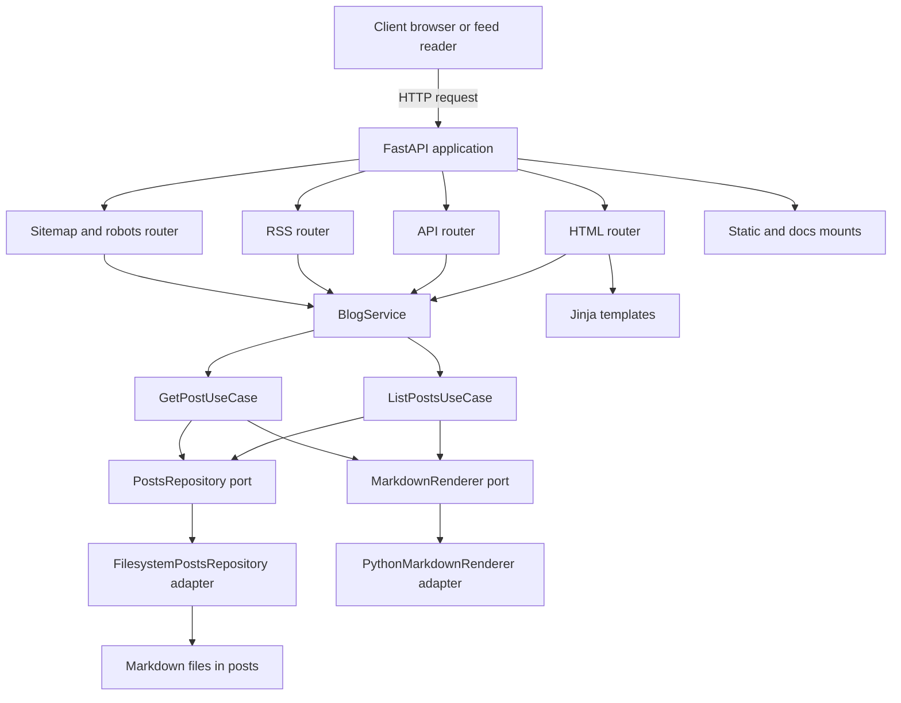
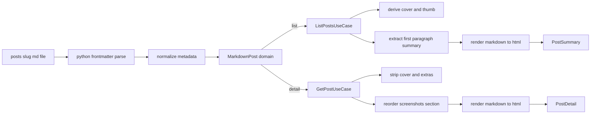

# Architecture

This repository is a small, layered FastAPI application that serves a personal site (blog + portfolio) from Markdown files in [`posts/`](posts/).

The codebase follows a light Clean Architecture / Ports-and-Adapters approach:

- **HTTP layer** (FastAPI routers) handles request/response + view-model shaping.
- **Service layer** provides a stable façade for the UI/API.
- **Use cases** implement the application logic (list posts, get post).
- **Ports** define interfaces for infrastructure concerns.
- **Adapters** implement ports (filesystem repo, markdown renderer).
- **Domain models** define the core data structures.

## High-level component view

## Entry points

- Primary app factory: [`create_app()`](app/main.py:18)
  - Enforces canonical host + HTTPS via middleware: [`enforce_canonical_host_and_scheme()`](app/main.py:36)
  - Mounts [`/static`](app/main.py:56) and [`/docs`](app/main.py:57)
  - Configures Jinja with auto-reload and no template cache: [`Environment(...)`](app/main.py:62)
  - Registers routers: [`include_router(...)`](app/main.py:74)

- Deployment shim: [`main.py`](main.py)
  - Exists because Render runs [`uvicorn main:app`](main.py:3) per [`render.yaml`](render.yaml:1)
  - Imports the real app from [`app.main`](main.py:5)

## Modules and responsibilities

### `app/http` (presentation + routing)

- Dependency wiring: [`get_blog_service()`](app/http/deps.py:25)
  - Builds [`BlogService`](app/services/blog_service.py:12)
  - Uses `lru_cache` to keep singleton-ish adapters for repo + renderer: [`_posts_repo()`](app/http/deps.py:15), [`_markdown_renderer()`](app/http/deps.py:20)

- SEO utilities:
  - Canonical base URL resolution with env override: [`get_site_url()`](app/http/seo.py:17) using `SITE_URL`
  - Canonical URL builder: [`canonical_url_for_request()`](app/http/seo.py:42)
- Meta description normalization: [`build_meta_description()`](app/http/seo.py:54)
- Date formatting for structured data: [`to_iso_date()`](app/http/seo.py:76)
  - Datetime formatting for OpenGraph article meta: [`to_iso_datetime()`](app/http/seo.py:97)

- HTML routes (server-rendered pages): [`router`](app/http/routers/html.py:25)
  - Homepage: [`homepage()`](app/http/routers/html.py:376)
    - Builds `homepage_projects` (Featured Projects, Leadership content, Backlog, Tooling)
    - Leadership content is auto-surfaced from posts tagged `cat:Leadership` (case-insensitive) via [`_homepage_leadership_items()`](app/http/routers/html.py:240)
  - Posts index + filtering: [`posts_index()`](app/http/routers/html.py:469)
- Post detail: [`read_post()`](app/http/routers/html.py:673)
  - Additional pages: [`about_page()`](app/http/routers/html.py:590), [`help_page()`](app/http/routers/html.py:617), [`battlestation_page()`](app/http/routers/html.py:644)
  - Builds a shared page context for templates: [`_base_context()`](app/http/routers/html.py:290)
  - Computes sidebar categories from explicit `cat:` tags (drives `/posts?q=cat:<Label>`): [`_sidebar_categories()`](app/http/routers/html.py:215)
  - Blog filtering on index pages is driven by the `cat:Blog` tag check: [`_is_blog_post_by_cat()`](app/http/routers/html.py:202)

- API routes (JSON): [`router`](app/http/routers/api.py:11)
  - List posts: [`list_posts()`](app/http/routers/api.py:14)
  - Post detail: [`get_post()`](app/http/routers/api.py:62)
  - Lightweight OpenGraph meta endpoint: [`get_post_meta()`](app/http/routers/api.py:29)
  - Response schemas: [`PostSummaryResponse`](app/http/schemas.py:8), [`PostDetailResponse`](app/http/schemas.py:16)

- RSS feed: [`rss_feed()`](app/http/routers/rss.py:109)
  - Renders RSS 2.0 via `xml.etree.ElementTree`
  - Computes RFC 822 dates from stored `YYYY-MM-DD HH:MM`: [`_rfc822_date()`](app/http/routers/rss.py:62)
  - Includes Media RSS thumbnails (Feedly-friendly) and `content:encoded`

- Sitemap + robots: [`sitemap_xml()`](app/http/routers/sitemap.py:17), [`robots_txt()`](app/http/routers/sitemap.py:51)
  - `robots.txt` is sourced from [`static/robots.txt`](static/robots.txt) but the Sitemap line is rewritten per environment

### `app/services` (service layer)

- Single façade used by routers: [`BlogService`](app/services/blog_service.py:12)
  - Delegates to use cases: [`list_posts()`](app/services/blog_service.py:18), [`get_post()`](app/services/blog_service.py:21)

### `app/usecases` (application logic)

- List posts and compute summaries: [`ListPostsUseCase.execute()`](app/usecases/list_posts.py:106)
  - Loads all posts from the repository
  - Computes cover image (from frontmatter or first standalone image paragraph)
  - Strips cover from body content to avoid duplication
  - Extracts summary as the first paragraph: [`_extract_summary_markdown()`](app/usecases/list_posts.py:13)
  - Sorts by `date` descending (string sort): [`sorted(..., key=lambda p: p.date, reverse=True)`](app/usecases/list_posts.py:156)

- Get post and produce full HTML: [`GetPostUseCase.execute()`](app/usecases/get_post.py:148)
  - Similar cover and extra image stripping logic
  - Reorders or injects a Screenshots section around a `Problem → Solution → Impact` section when present:
    - Detect: [`_has_problem_solution_impact_section()`](app/usecases/get_post.py:123)
    - Extract embedded screenshots: [`_extract_markdown_sections()`](app/usecases/get_post.py:17)
    - Insert: [`_insert_screenshots_after_problem_solution_impact()`](app/usecases/get_post.py:69)
  - Produces a [`PostDetail`](app/domain/models.py:41)

### `app/ports` (interfaces)

- Posts repository port: [`PostsRepository`](app/ports/posts_repository.py:8)
- Markdown rendering port: [`MarkdownRenderer`](app/ports/markdown_renderer.py:6)

### `app/adapters` (infrastructure)

- Filesystem-backed repository: [`FilesystemPostsRepository`](app/adapters/filesystem_posts_repository.py:16)
  - Reads `*.md` from [`posts/`](posts/)
  - Parses YAML frontmatter via `python-frontmatter`: [`frontmatter.loads(...)`](app/adapters/filesystem_posts_repository.py:47)
  - Normalizes `date` into `YYYY-MM-DD HH:MM`: [`_normalize_published_at()`](app/adapters/filesystem_posts_repository.py:93)
  - UTF-8 decoding with BOM tolerance to preserve smart quotes and emoji: [`read_text(encoding='utf-8')`](app/adapters/filesystem_posts_repository.py:42)

- Markdown renderer adapter: [`PythonMarkdownRenderer`](app/adapters/markdown_python_renderer.py:11)
  - Uses the `markdown` library with extensions: [`extensions`](app/adapters/markdown_python_renderer.py:15)

### `app/domain` (core types)

- Source-of-truth post from storage: [`MarkdownPost`](app/domain/models.py:8)
- List projection for index pages: [`PostSummary`](app/domain/models.py:26)
- Full post projection for detail pages: [`PostDetail`](app/domain/models.py:41)

## Key runtime flows

### Flow: homepage HTML

1. Request hits FastAPI app: [`create_app()`](app/main.py:18)
2. HTML router handles `/`: [`homepage()`](app/http/routers/html.py:376)
3. Blog service is injected: [`get_blog_service()`](app/http/deps.py:25)
4. `homepage()` computes:
   - Shared request context (canonical URL, defaults, query state): [`_base_context()`](app/http/routers/html.py:290)
   - Sidebar categories: [`_sidebar_categories()`](app/http/routers/html.py:215)
   - Cover/thumb/blurb indexes for homepage buttons: [`_post_cover_index()`](app/http/routers/html.py:74), [`_post_thumb_index()`](app/http/routers/html.py:84), [`_post_blurb_index()`](app/http/routers/html.py:95)
   - Frontmatter emoji index used by the Leadership content menu: [`_post_frontmatter_emoji_index()`](app/http/routers/html.py:279)
   - Leadership content items (auto from `cat:Leadership`, newest-first): [`_homepage_leadership_items()`](app/http/routers/html.py:240)
5. Response renders via Jinja templates: [`get_templates()`](app/http/deps.py:34)

### Flow: posts index HTML

1. `/posts` hits [`posts_index()`](app/http/routers/html.py:469)
2. Fetch summaries: [`blog.list_posts()`](app/services/blog_service.py:18) → [`ListPostsUseCase.execute()`](app/usecases/list_posts.py:106)
3. Router applies query/category logic:
   - Default behaviour is “projects only” (exclude posts tagged `cat:Blog`) unless the user explicitly includes blog entries (`exclude_blog=0`).
   - Category deep-links: when `q` is an exact `cat:<Label>` query, filter posts by exact tag.
   - Blog posts are always included when browsing `q=cat:Blog`.
   - Blog membership is the `cat:Blog` tag check: [`_is_blog_post_by_cat()`](app/http/routers/html.py:202)
4. Template renders list: [`templates/posts.html`](templates/posts.html)

### Flow: post detail HTML

1. `/posts/{slug}` hits [`read_post()`](app/http/routers/html.py:673)
2. Load post detail: [`blog.get_post()`](app/services/blog_service.py:21) → [`GetPostUseCase.execute()`](app/usecases/get_post.py:148)
3. Router builds SEO metadata:
   - Canonical: [`canonical_url_for_request()`](app/http/seo.py:42)
   - Meta description: [`build_meta_description()`](app/http/seo.py:54)
   - Structured data date: [`to_iso_date()`](app/http/seo.py:76)
   - OpenGraph article timestamps: [`to_iso_datetime()`](app/http/seo.py:97)
   - JSON-LD emitted:
     - `BlogPosting` + `BreadcrumbList` via the two JSON-LD slots in [`templates/base.html`](templates/base.html:64)
   - Future-post guardrail: SEO completeness is enforced by [`test_all_posts_have_required_seo_meta_and_valid_jsonld()`](tests/test_seo.py:206) which iterates all slugs from [`FilesystemPostsRepository.list_posts()`](app/adapters/filesystem_posts_repository.py:21)
4. Template renders post: [`templates/post.html`](templates/post.html)

### Flow: RSS

1. `/rss.xml` hits [`rss_feed()`](app/http/routers/rss.py:109)
2. Takes the latest 20 posts: [`posts = posts[:20]`](app/http/routers/rss.py:114)
3. For each item it:
   - Uses summary HTML for `<description>`
   - Optionally loads full detail to find an image + full content
   - Emits media thumbnails early for compatibility

### Flow: sitemap and robots

- `/sitemap.xml` lists core routes and every post: [`sitemap_xml()`](app/http/routers/sitemap.py:17)
- `/robots.txt` reads [`static/robots.txt`](static/robots.txt) and rewrites `Sitemap:` based on runtime base URL: [`robots_txt()`](app/http/routers/sitemap.py:51)

## Content pipeline

### Markdown + frontmatter expectations

- Posts must start with a frontmatter delimiter line `---`.
- Metadata (common): `title`, `date`, `tags`, plus optional `blurb`, `one_liner`, `image`, `thumb_image`, `social_image`, `extra_images`.
- The repository normalizes the `date` field into a consistent string format for sorting and display: [`_normalize_published_at()`](app/adapters/filesystem_posts_repository.py:93)

## Templates and static assets

- Templates are stored in [`templates/`](templates/)
  - Home: [`templates/index.html`](templates/index.html)
    - The homepage panels are rendered in template order. As of now, `Leadership content` appears above `Featured Projects`: [`templates/index.html`](templates/index.html:71)
  - Posts list: [`templates/posts.html`](templates/posts.html)
  - Post detail: [`templates/post.html`](templates/post.html)
  - Shared layout: [`templates/base.html`](templates/base.html)

- Static assets are served from [`static/`](static/)
  - JS helpers: [`static/search.js`](static/search.js), [`static/read-time.js`](static/read-time.js)
  - Styles: [`static/styles.css`](static/styles.css)
  - SEO assets: [`static/robots.txt`](static/robots.txt), [`static/sitemap.xml`](static/sitemap.xml)

## Operational notes

- Deployment configuration: [`render.yaml`](render.yaml:1)
  - Build: `pip install -r requirements.txt`
  - Start: `uvicorn main:app --host 0.0.0.0 --port 10000`

- Configuration:
  - `SITE_URL` (optional) controls canonical URLs and sitemap base: [`get_site_url()`](app/http/seo.py:17)

- Performance and caching:
  - Repo + renderer are cached with `lru_cache` to avoid rebuilding for every request: [`_posts_repo()`](app/http/deps.py:15)
  - Templates are configured with auto-reload and no cache (dev-friendly): [`auto_reload=True`](app/main.py:65), [`cache_size=0`](app/main.py:66)

## Extending the system

### Add a new post

1. Create a new `*.md` in [`posts/`](posts/) with YAML frontmatter.
2. The slug is the filename stem (e.g. `blog7.md` → `blog7`).
3. It will automatically appear in `/posts`, RSS and sitemap.

### Add a new page

1. Add a route to the HTML router: [`app/http/routers/html.py`](app/http/routers/html.py:1)
2. Create a template under [`templates/`](templates/)
3. Optionally update the sitemap list of core pages: [`sitemap_xml()`](app/http/routers/sitemap.py:17)

### Swap storage or rendering

- Implement a new adapter for [`PostsRepository`](app/ports/posts_repository.py:8) (e.g. database-backed).
- Implement a new adapter for [`MarkdownRenderer`](app/ports/markdown_renderer.py:6) (e.g. different markdown engine).
- Wire it in via [`get_blog_service()`](app/http/deps.py:25) and its cached factories.

