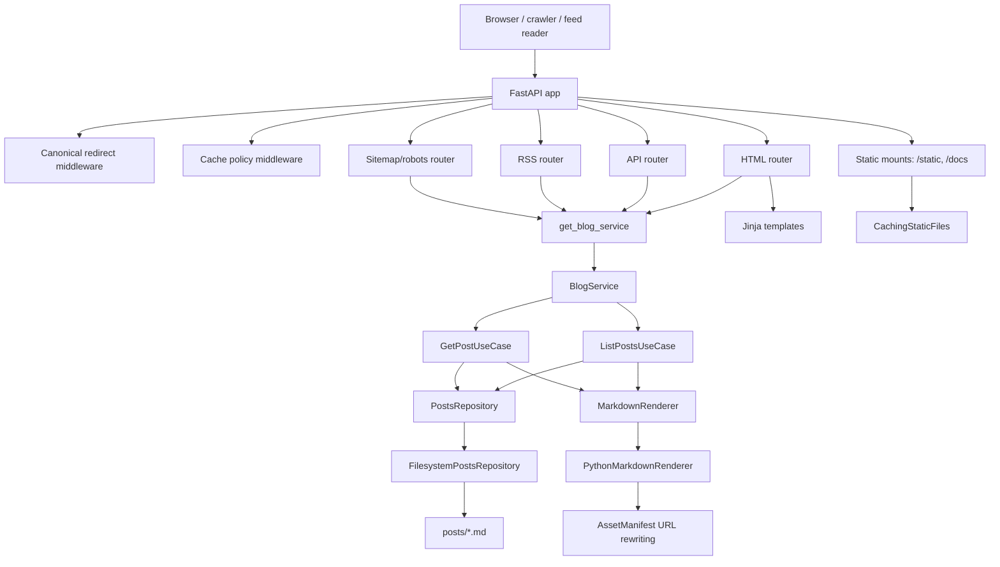

# Architecture

CrankTheCode is a small FastAPI application that serves a personal site (blog + portfolio + “Decision Architecture” topic hubs) from Markdown posts, plus a lightweight static asset fingerprinting pipeline and an EPUB book builder.

## What runs in production

- Render starts Uvicorn against the repo-root shim: [`render.yaml`](render.yaml:1) → [`main.py`](main.py:1)
  - `main.py` exists as a compatibility layer for `uvicorn main:app` deployments and local `python main.py`: [`main.py`](main.py:1)
- Real ASGI app + app factory live in: [`create_app()`](app/main.py:22) and module-level [`app`](app/main.py:126)

### HTTP middleware and runtime policies

Both of these are defined inside [`create_app()`](app/main.py:22):

- Canonical host + https redirects (301) for non-local hosts: middleware [`enforce_canonical_host_and_scheme`](app/main.py:40)
  - Canonical host constant is currently hard-coded to `www.crankthecode.com`: [`CANONICAL_HOST`](app/main.py:37)
- Response cache policy by content-type (HTML is no-store; RSS/sitemap/robots must-revalidate): middleware [`cache_policy_middleware`](app/main.py:60)

## High-level shape (light “ports/adapters”)

The codebase is intentionally simple and uses a light Ports and Adapters / Clean Architecture flavor:

- **Presentation**: FastAPI routers for HTML pages, JSON API, RSS, sitemap/robots.
- **Application**: a service façade plus use cases.
- **Domain**: typed dataclasses and tag parsing/normalization.
- **Infrastructure/Adapters**: filesystem repository, Markdown rendering strategy, static asset pipeline + caching.

Key types:

- Service façade: [`BlogService`](app/services/blog_service.py:12)
- Use cases: [`ListPostsUseCase.execute()`](app/usecases/list_posts.py:106), [`GetPostUseCase.execute()`](app/usecases/get_post.py:164)
- Domain models: [`MarkdownPost`](app/domain/models.py:8), [`PostSummary`](app/domain/models.py:29), [`PostDetail`](app/domain/models.py:45)
- Ports: [`PostsRepository`](app/ports/posts_repository.py:1), [`MarkdownRenderer`](app/ports/markdown_renderer.py:1)
- Adapters: [`FilesystemPostsRepository`](app/adapters/filesystem_posts_repository.py:16), [`PythonMarkdownRenderer`](app/adapters/markdown_python_renderer.py:12)

Composition root for the blog service lives in the presentation layer dependency module:

- [`get_blog_service()`](app/http/deps.py:25) wires repo + renderer + use cases.

```mermaid
flowchart TD
  U[Browser / crawler / feed reader] --> APP[FastAPI app]

  APP --> M1[Canonical redirect middleware]
  APP --> M2[Cache policy middleware]

  APP --> HTML[HTML router]
  APP --> API[API router]
  APP --> RSS[RSS router]
  APP --> SEO[Sitemap/robots router]

  HTML --> DI[get_blog_service]
  API --> DI
  RSS --> DI
  SEO --> DI

  DI --> SVC[BlogService]
  SVC --> LUC[ListPostsUseCase]
  SVC --> GUC[GetPostUseCase]

  LUC --> REP[PostsRepository]
  GUC --> REP
  LUC --> MR[MarkdownRenderer]
  GUC --> MR

  REP --> FS[FilesystemPostsRepository]
  MR --> REND[PythonMarkdownRenderer]

  FS --> MD[posts/*.md]
  HTML --> TPL[Jinja templates]
  APP --> STA[Static mounts: /static, /docs]
  STA --> CFS[CachingStaticFiles]
  REND --> ASM[AssetManifest URL rewriting]
```

## Request flows

### Homepage (`/`)

- Route handler: [`homepage()`](app/http/routers/html.py:687)
- Shared request context (canonical URL, query state, defaults): [`_base_context()`](app/http/routers/html.py:443)
- Homepage JSON-LD is created server-side and emitted via template slots: [`jsonld_json`](templates/base.html:76)

### Posts index (`/posts`)

- Route handler: [`posts_index()`](app/http/routers/html.py:820)
- Default behaviour hides blog posts from listing unless explicitly included via `exclude_blog=0`-like truthy values: [`exclude_blog`](app/http/routers/html.py:447)
- Filtering inputs:
  - legacy `q=cat:<Label>` is still supported via `current_q`: [`current_q`](app/http/routers/html.py:472)
  - newer query params `cat=<Label>` and `layer=<slug>` are also tracked in base context: [`current_cat`](app/http/routers/html.py:473), [`current_layer`](app/http/routers/html.py:474)

### Post detail (`/posts/{slug}`)

- Route handler: [`read_post()`](app/http/routers/html.py:1410)
- Content is produced by the application layer: [`GetPostUseCase.execute()`](app/usecases/get_post.py:164)
- Canonical URL preserves query string (e.g. for filtered listings): [`canonical_url_for_request()`](app/http/seo.py:41)
- Meta description is built from frontmatter (blurb first, then one-liner fallback): [`build_meta_description()`](app/http/seo.py:53)
- JSON-LD is emitted by the base template in two slots (primary + optional “extra” graph): [`templates/base.html`](templates/base.html:76)

### RSS, sitemap, robots

- RSS feed: [`rss_feed()`](app/http/routers/rss.py:158)
  - Excludes Leadership/Decision-Architecture stream: [`_is_leadership_post()`](app/http/routers/rss.py:129)
  - Uses Media RSS thumbnails + CDATA for HTML bodies: [`_wrap_cdata()`](app/http/routers/rss.py:33)
- Sitemap: [`sitemap_xml()`](app/http/routers/sitemap.py:17)
- Robots: [`robots_txt()`](app/http/routers/sitemap.py:67)

## Content model and authoring contract (posts)

Posts are `posts/*.md` files with YAML frontmatter loaded via the filesystem repository: [`FilesystemPostsRepository`](app/adapters/filesystem_posts_repository.py:16).

### Supported frontmatter (current)

The post storage model is: [`MarkdownPost`](app/domain/models.py:8). In addition to `title`, `date`, and `tags`, it supports:

- `blurb` (used for meta description and list UI)
- `one_liner` (used for social preview snippets)
- `image` (explicit cover image; also used as default thumbnail)
- `thumb_image` (optional tile thumbnail; falls back to `image`): [`thumb_image`](app/domain/models.py:18)
- `emoji` (optional visual thumbnail): [`emoji`](app/domain/models.py:22)
- `social_image` (OpenGraph/Twitter image; falls back to cover): [`social_image`](app/domain/models.py:24)
- `extra_images` (gallery/screenshot images): [`extra_images`](app/domain/models.py:20)

### Normalization rules

- Tags are normalized to a list of strings: [`FilesystemPostsRepository._normalize_tags()`](app/adapters/filesystem_posts_repository.py:34)
- Dates are normalized to a sortable string format currently stored as `YYYY-MM-DD HH:MM`: [`FilesystemPostsRepository._normalize_published_at()`](app/adapters/filesystem_posts_repository.py:141)
- Safety-net: files named `blog*.md` are always discoverable under `cat:Blog` even if missing the tag: [`slug.lower().startswith("blog")`](app/adapters/filesystem_posts_repository.py:103)

### Rendering rules (covers + screenshots)

Rendering is intentionally a *use case concern* (so HTML shape stays testable and consistent):

- List views extract the first paragraph as a summary, and handle cover/thumb selection/stripping: [`ListPostsUseCase.execute()`](app/usecases/list_posts.py:106)
- Detail views strip an explicit cover image paragraph near the top, protect author screenshots sections, and can inject a controlled “Screenshots” section from `extra_images`: [`GetPostUseCase.execute()`](app/usecases/get_post.py:164)
  - Special-case AxisDB: inject an install prompt snippet after the “Problem→Solution→Impact” section: [`_axisdb_install_prompt_markdown()`](app/usecases/get_post.py:133)

Tags also power UI navigation and structured data:

- `layer:` tags are normalized and humanized for Leadership topic hubs: [`normalize_layer_slug()`](app/domain/tags.py:10), [`humanize_layer_slug()`](app/domain/tags.py:41)
- Topic hubs are derived from `cat:Leadership` + `layer:` tags in the HTML router: [`_leadership_topic_hubs()`](app/http/routers/html.py:534)

## Templates, static assets, and caching

### Templates

- Jinja environment is created in the app factory and stored in app state: [`fastapi_app.state.templates`](app/main.py:109)
- Global helper `asset_url()` is exposed to templates for fingerprinted URLs: [`env.globals["asset_url"]`](app/main.py:108)
- Base template owns SEO and JSON-LD slots: [`templates/base.html`](templates/base.html:1)

### Static assets in runtime

Static files are served via a caching-aware StaticFiles subclass:

- Static mount: [`fastapi_app.mount("/static", ...)`](app/main.py:95)
- Implementation: [`CachingStaticFiles`](app/assets/staticfiles.py:13)
  - Fingerprinted filenames cache for 1y immutable: [`get_response()`](app/assets/staticfiles.py:23)
  - Non-fingerprinted assets are `no-cache, must-revalidate` as a safe fallback: [`Cache-Control`](app/assets/staticfiles.py:35)

The app mounts `/docs` for public artifacts like the EPUB output: [`fastapi_app.mount("/docs", ...)`](app/main.py:96)

### Asset fingerprinting pipeline (build step)

Render runs an explicit build step before starting the app: [`buildCommand`](render.yaml:5).

- Builder script: [`build_static_dist()`](app/assets/build_static.py:24)
  - Copies every file to its original path in `static_dist/` *and* emits a fingerprinted copy.
  - Writes `manifest.json` mapping logical rel-path → fingerprinted rel-path.
- Manifest loader + URL rewriting:
  - Load: [`AssetManifest.load()`](app/assets/manifest.py:27)
  - Template helper: [`asset_url()`](app/assets/manifest.py:136)
  - Rewrite `/static/...` URLs inside rendered HTML: [`rewrite_html_static_urls()`](app/assets/manifest.py:77)

Runtime selection:

- The app serves from `static_dist/` when present, otherwise falls back to `static/`: [`static_dir`](app/main.py:90)
- Environment overrides:
  - `CTC_STATIC_DIST_DIR` selects the served static directory: [`CTC_STATIC_DIST_DIR`](app/main.py:89)
  - `CTC_STATIC_MANIFEST_PATH` selects manifest file path: [`_default_manifest_path()`](app/assets/manifest.py:118)
  - The build script also supports `CTC_STATIC_SRC_DIR` + `CTC_STATIC_HASH_LEN`: [`main()`](app/assets/build_static.py:77)

## Book builder (Decision Architecture EPUB)

The repository also ships a small book-building subsystem that compiles selected posts into an EPUB.

- Script entrypoint: [`main()`](book/build_decision_architecture_book.py:48)
  - Adds repo root to `sys.path` when executed from inside `book/`: [`_find_repo_root_for_script()`](book/build_decision_architecture_book.py:13)
- Orchestrator / “use case”: [`BuildOrchestrator.build()`](book/book_builder/orchestrator.py:19)
  - Reads source posts from `posts/` but filters to those with `layer:` tags: [`FilesystemBookPostsRepository.list_posts()`](book/book_builder/repository.py:17)
  - Uses shared tag logic from the app domain to keep layer parsing consistent: [`primary_layer_slug_from_tags()`](app/domain/tags.py:73)
- Output is written under `docs/` so it can be served publicly at `/docs/...` without exposing the whole book source tree: [`output_file`](book/book_builder/paths.py:40)
- EPUB build is executed by calling `pandoc` via subprocess:
  - Command construction + up-to-date checks: [`PandocEpubBuilder.build()`](book/book_builder/pandoc_epub.py:29)

## Tests (architecture regression nets)

The test suite doubles as architecture enforcement by locking in outward behaviour (routing, SEO, caching, and deterministic HTML output).

- Canonical redirect middleware behaviour: [`test_canonical_redirect_middleware_redirects_http_apex_to_https_www()`](tests/test_canonical_redirect_middleware.py:18)
- SEO regression net for every post: [`test_all_posts_have_required_seo_meta_and_valid_jsonld()`](tests/test_seo.py:226)
- Entrypoint shim coverage (`python main.py` path without starting Uvicorn): [`test_root_main_module_can_run_as_script_without_starting_server()`](tests/test_entrypoints.py:23)
