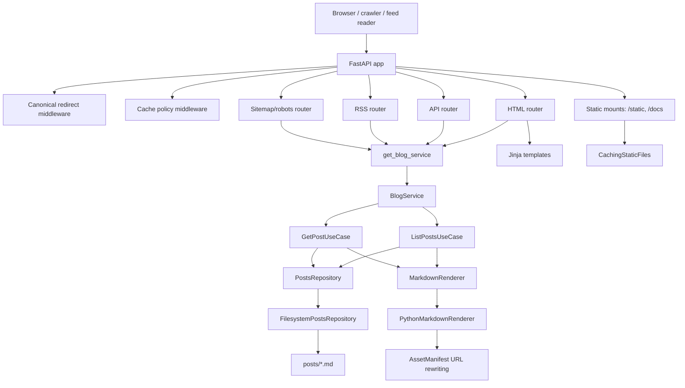

# Architecture

CrankTheCode is a small FastAPI application that serves a personal site (posts + portfolio + Decision Architecture hubs + Decision Architecture Patterns hubs + a Books catalogue page) from Markdown posts, plus a lightweight static asset fingerprinting pipeline and an EPUB book builder.

## What runs in production

- Render starts Uvicorn against the repo-root shim: [`render.yaml`](render.yaml:1) → [`main.py`](main.py:1)
  - `main.py` exists as a compatibility layer for `uvicorn main:app` deployments and local `python main.py`: [`main.py`](main.py:1)
- Real ASGI app + app factory live in: [`create_app()`](app/main.py:22) and module-level [`app`](app/main.py:154)

### HTTP middleware and runtime policies

Both of these are defined inside [`create_app()`](app/main.py:22):

- Canonical host + https redirects (301) for non-local hosts: middleware [`enforce_canonical_host_and_scheme`](app/main.py:39)
  - Canonical host constant is currently hard-coded to `www.crankthecode.com`: [`CANONICAL_HOST`](app/main.py:37)
- Response cache policy by content-type (HTML is no-store; RSS/sitemap/robots must-revalidate): middleware [`cache_policy_middleware`](app/main.py:59)

## High-level shape (light “ports/adapters”)

The codebase is intentionally simple and uses a light Ports and Adapters / Clean Architecture flavor:

- **Presentation**: FastAPI routers for HTML pages, JSON API, RSS, sitemap/robots.
- **Application**: a service façade plus use cases.
- **Domain**: typed dataclasses and tag parsing/normalization.
- **Infrastructure/Adapters**: filesystem repository, Markdown rendering strategy, static asset pipeline + caching.

Key types:

- Service façade: [`BlogService`](app/services/blog_service.py:12)
- Use cases: [`ListPostsUseCase.execute()`](app/usecases/list_posts.py:106), [`GetPostUseCase.execute()`](app/usecases/get_post.py:164)
- Domain models: [`MarkdownPost`](app/domain/models.py:8), [`PostSummary`](app/domain/models.py:29), [`PostDetail`](app/domain/models.py:45)
- Ports: [`PostsRepository`](app/ports/posts_repository.py:1), [`MarkdownRenderer`](app/ports/markdown_renderer.py:1)
- Adapters: [`FilesystemPostsRepository`](app/adapters/filesystem_posts_repository.py:16), [`PythonMarkdownRenderer`](app/adapters/markdown_python_renderer.py:12)

Composition root for the blog service lives in the presentation layer dependency module:

- [`get_blog_service()`](app/http/deps.py:25) wires repo + renderer + use cases.

```mermaid
flowchart TD
  U[Browser / crawler / feed reader] --> APP[FastAPI app]

  APP --> M1[Canonical redirect middleware]
  APP --> M2[Cache policy middleware]

  APP --> HTML[HTML router]
  APP --> API[API router]
  APP --> RSS[RSS router]
  APP --> SEO[Sitemap/robots router]

  HTML --> DI[get_blog_service]
  API --> DI
  RSS --> DI
  SEO --> DI

  DI --> SVC[BlogService]
  SVC --> LUC[ListPostsUseCase]
  SVC --> GUC[GetPostUseCase]

  LUC --> REP[PostsRepository]
  GUC --> REP
  LUC --> MR[MarkdownRenderer]
  GUC --> MR

  REP --> FS[FilesystemPostsRepository]
  MR --> REND[PythonMarkdownRenderer]

  FS --> MD[posts/*.md]
  HTML --> TPL[Jinja templates]
  APP --> STA[Static mounts: /static, /docs]
  STA --> CFS[CachingStaticFiles]
  REND --> ASM[AssetManifest URL rewriting]
```

## Request flows

### Homepage (`/`)

- Route handler: [`homepage()`](app/http/routers/html.py:1185)
- Shared request context (canonical URL, query state, defaults): [`_base_context()`](app/http/routers/html.py:606)
- Homepage JSON-LD is created server-side and emitted via template slots: [`jsonld_json`](templates/base.html:90)

The homepage is intentionally a gateway (not a post listing).

It contains:

- A featured single-post CTA for the thesis post:
  - Source post: [`posts/OODAThesisDistilled.md`](posts/OODAThesisDistilled.md:1)
  - Link target: `/posts/OODAThesisDistilled`
- Two gateway cards routing users into the two Decision Architecture ecosystems:

- Decision Architecture (Structures) → `/decision-architecture`
- Decision Architecture Patterns → `/patterns`

Template: [`templates/index.html`](templates/index.html:60)

Visual structure on the homepage is intentionally separated by the green “pill” divider:

- Separator component: [`post-separator`](static/styles.css:1396)

### Books (`/books`)

- Route handler: [`books_page()`](app/http/routers/html.py:1775)
- Template: [`templates/books.html`](templates/books.html:1)
- Book metadata is centralized to avoid duplication:
  - [`BOOKS_CATALOGUE`](app/domain/books_catalogue.py:29)

The Books page presents a calm visual catalogue (covers only, linked to Amazon) with restrained spacing.

### Posts index (`/posts`)

- Route handler: [`posts_index()`](app/http/routers/html.py:1493)
- Default behaviour hides blog posts from listing unless explicitly included via `exclude_blog=0`-like truthy values: [`exclude_blog`](app/http/routers/html.py:638)
- Filtering inputs:
  - legacy `q=cat:<Label>` is still supported via `current_q`: [`current_q`](app/http/routers/html.py:635)
  - newer query params `cat=<Label>` and `layer=<slug>` are also tracked in base context: [`current_cat`](app/http/routers/html.py:636), [`current_layer`](app/http/routers/html.py:637)

### Post detail (`/posts/{slug}`)

- Route handler: [`read_post()`](app/http/routers/html.py:2186)
- Content is produced by the application layer: [`GetPostUseCase.execute()`](app/usecases/get_post.py:164)
- Canonical URL preserves query string (e.g. for filtered listings): [`canonical_url_for_request()`](app/http/seo.py:41)
- Meta description is built from frontmatter (blurb first, then one-liner fallback): [`build_meta_description()`](app/http/seo.py:53)
- JSON-LD is emitted by the base template in two slots (primary + optional extra graph): [`templates/base.html`](templates/base.html:1)

### Decision Architecture gateways and hubs

There are two parallel “layer hub” systems.

#### Decision Architecture (Structures)

- Gateway (grouped listing by `layer:`): `/decision-architecture`
  - Route: [`decision_architecture_gateway()`](app/http/routers/html.py:1269)
  - Template: [`templates/decision_architecture.html`](templates/decision_architecture.html:1)
- Layer hubs (per-layer listing): `/topics/<layer>`
  - Route: [`topic_hub_page()`](app/http/routers/html.py:2026)
  - Template: [`templates/topic_hub.html`](templates/topic_hub.html:1)

#### Decision Architecture Patterns

- Gateway (grouped listing by `layer:`): `/patterns`
  - Route: [`patterns_index()`](app/http/routers/html.py:1397)
  - Template: [`templates/patterns_index.html`](templates/patterns_index.html:1)
- Layer hubs (per-layer listing): `/patterns/<layer>`
  - Route: [`patterns_layer_page()`](app/http/routers/html.py:1449)
  - Template: [`templates/patterns_hub.html`](templates/patterns_hub.html:1)

#### Shared “all layers” hub (`/topics`)

`/topics` is the shared “View all layers” destination for both ecosystems.

It renders two pill rows (and intentionally does **not** duplicate those destinations as a second hub-list section):

- Patterns layers → `/patterns/<layer>`
- Structures layers → `/topics/<layer>`

Route + template:

- [`topics_index()`](app/http/routers/html.py:1920)
- [`templates/topics_index.html`](templates/topics_index.html:1)

### RSS, sitemap, robots

- RSS feed: [`rss_feed()`](app/http/routers/rss.py:158)
  - Excludes Leadership/Decision-Architecture stream: [`_is_leadership_post()`](app/http/routers/rss.py:129)
  - Uses Media RSS thumbnails + CDATA for HTML bodies: [`_wrap_cdata()`](app/http/routers/rss.py:33)
- Sitemap: [`sitemap_xml()`](app/http/routers/sitemap.py:17)
- Robots: [`robots_txt()`](app/http/routers/sitemap.py:81)

## Content model and authoring contract (posts)

Posts are `posts/*.md` files with YAML frontmatter loaded via the filesystem repository: [`FilesystemPostsRepository`](app/adapters/filesystem_posts_repository.py:16).

### Supported frontmatter (current)

The post storage model is: [`MarkdownPost`](app/domain/models.py:8). In addition to `title`, `date` and `tags`, it supports:

- `blurb` (used for meta description and list UI)
- `one_liner` (used for social preview snippets)
- `image` (explicit cover image; also used as default thumbnail)
- `thumb_image` (optional tile thumbnail; falls back to `image`): [`thumb_image`](app/domain/models.py:18)
- `emoji` (optional visual thumbnail): [`emoji`](app/domain/models.py:22)
- `social_image` (OpenGraph/Twitter image; falls back to cover): [`social_image`](app/domain/models.py:24)
- `extra_images` (gallery/screenshot images): [`extra_images`](app/domain/models.py:20)

### Normalization rules

- Tags are normalized to a list of strings: [`FilesystemPostsRepository._normalize_tags()`](app/adapters/filesystem_posts_repository.py:34)
- Dates are normalized to a sortable string format currently stored as `YYYY-MM-DD HH:MM`: [`FilesystemPostsRepository._normalize_published_at()`](app/adapters/filesystem_posts_repository.py:141)
- Safety-net: files named `blog*.md` are always discoverable under `cat:Blog` even if missing the tag: [`slug.lower().startswith("blog")`](app/adapters/filesystem_posts_repository.py:103)

### Rendering rules (covers + screenshots)

Rendering is intentionally a use case concern (so HTML shape stays testable and consistent):

- List views extract the first paragraph as a summary and handle cover/thumb selection/stripping: [`ListPostsUseCase.execute()`](app/usecases/list_posts.py:106)
- Detail views strip an explicit cover image paragraph near the top, protect author screenshots sections and can inject a controlled Screenshots section from `extra_images`: [`GetPostUseCase.execute()`](app/usecases/get_post.py:164)
  - Special-case AxisDB: inject an install prompt snippet after the Problem→Solution→Impact section: [`_axisdb_install_prompt_markdown()`](app/usecases/get_post.py:133)

## Taxonomy conventions (navigation)

The site uses simple tag conventions to drive grouping and navigation:

- Primary category tags: `cat:<Label>`
  - Decision Architecture (Structures) is `cat:Leadership`.
  - Patterns is `cat:decision-architecture-patterns`.
- Layer tags: `layer:<slug>`
  - Used for grouping into layers (both ecosystems).
  - Normalization/humanization is shared: [`normalize_layer_slug()`](app/domain/tags.py:10) and [`humanize_layer_slug()`](app/domain/tags.py:41)

Decision Architecture (Structures) hubs are derived from `cat:Leadership` + `layer:` tags:

- [`_leadership_topic_hubs()`](app/http/routers/html.py:697)

Patterns hubs are derived from `cat:decision-architecture-patterns` + `layer:` tags:

- [`patterns_index()`](app/http/routers/html.py:1397)

## Templates, static assets and caching

### Templates

- Jinja environment is created in the app factory and stored in app state: [`fastapi_app.state.templates`](app/main.py:137)
- Global helper `asset_url()` is exposed to templates for fingerprinted URLs: [`env.globals["asset_url"]`](app/main.py:136)
- Base template owns SEO and JSON-LD slots and the global sidebar: [`templates/base.html`](templates/base.html:1)

Sidebar navigation is intentionally explicit/hardcoded (not derived from tags):

- Sidebar template: [`templates/base.html`](templates/base.html:308)

The sidebar is styled + sized in CSS:

- Layout column width (sidebar vs content): [`static/styles.css`](static/styles.css:219)

Sidebar section headers are clickable (and highlight when any child route is active):

- Template: [`templates/base.html`](templates/base.html:308)
- Styling: [`sidebar-link--section`](static/styles.css:337)

### Static assets in runtime

Static files are served via a caching-aware StaticFiles subclass:

- Static mount: [`fastapi_app.mount("/static", ...)`](app/main.py:119)
- Primary implementation: [`FallbackStaticFiles`](app/assets/staticfiles.py:40) + [`CachingStaticFiles`](app/assets/staticfiles.py:14)
  - Fingerprinted filenames cache for 1y immutable: [`CachingStaticFiles.get_response()`](app/assets/staticfiles.py:23)
  - Non-fingerprinted assets are `no-cache, must-revalidate` as a safe fallback: [`Cache-Control`](app/assets/staticfiles.py:35)

The app mounts `/docs` for public artifacts like the CV: [`fastapi_app.mount("/docs", ...)`](app/main.py:124)

EPUB files are retained in-repo but are no longer published under `/docs`.

### Asset fingerprinting pipeline (build step)

Render runs an explicit build step before starting the app: [`buildCommand`](render.yaml:5).

- Builder script: [`build_static_dist()`](app/assets/build_static.py:24)
  - Copies every file to its original path in `static_dist/` and emits a fingerprinted copy.
  - Writes `manifest.json` mapping logical rel-path → fingerprinted rel-path.
- Manifest loader + URL rewriting:
  - Load: [`AssetManifest.load()`](app/assets/manifest.py:27)
  - Template helper: [`asset_url()`](app/assets/manifest.py:136)
  - Rewrite `/static/...` URLs inside rendered HTML: [`rewrite_html_static_urls()`](app/assets/manifest.py:77)

Runtime selection:

- The app serves from `static_dist/` when present, otherwise falls back to `static/`: [`static_dir`](app/main.py:112)
- Environment overrides:
  - `CTC_USE_STATIC_DIST` toggles serving from `static_dist/` when present: [`use_static_dist`](app/main.py:108)
  - `CTC_STATIC_DIST_DIR` selects the served static directory: [`configured_static_dist_dir`](app/main.py:109)

## Book builder (Decision Architecture EPUB)

The repository also ships a small book-building subsystem that compiles selected posts into an EPUB.

- Script entrypoints:
  - Decision Architecture: [`main()`](book/build_decision_architecture_book.py:48)
  - Patterns: [`main()`](book/build_da_patterns_book.py:1)
- Orchestrator use case: [`BuildOrchestrator.build()`](book/book_builder/orchestrator.py:19)
  - Reads source posts from `posts/` (filtered by tags depending on the build script): [`FilesystemBookPostsRepository.list_posts()`](book/book_builder/repository.py:17)
  - Uses shared tag logic from the app domain to keep layer parsing consistent: [`primary_layer_slug_from_tags()`](app/domain/tags.py:73)
- Output is written under a non-public directory so EPUBs are retained but not served by the app:
  - Decision Architecture: [`output_file`](book/book_builder/paths.py:24) → `book/private_epubs/Decision-Architecture.epub`
  - Patterns build mirrors this to `book/private_epubs/decision-architecture-patterns.epub`: [`PatternsBookPaths.from_repo_root()`](book/build_da_patterns_book.py:80)
- EPUB build is executed by calling `pandoc` via subprocess:
  - Command construction + up-to-date checks: [`PandocEpubBuilder.build()`](book/book_builder/pandoc_epub.py:29)

## Tests (architecture regression nets)

The test suite doubles as architecture enforcement by locking in outward behaviour (routing, SEO, caching and deterministic HTML output).

- Canonical redirect middleware behaviour: [`test_canonical_redirect_middleware_redirects_http_apex_to_https_www()`](tests/test_canonical_redirect_middleware.py:18)
- Entrypoint shim coverage (`python main.py` path without starting Uvicorn): [`test_root_main_module_can_run_as_script_without_starting_server()`](tests/test_entrypoints.py:23)
