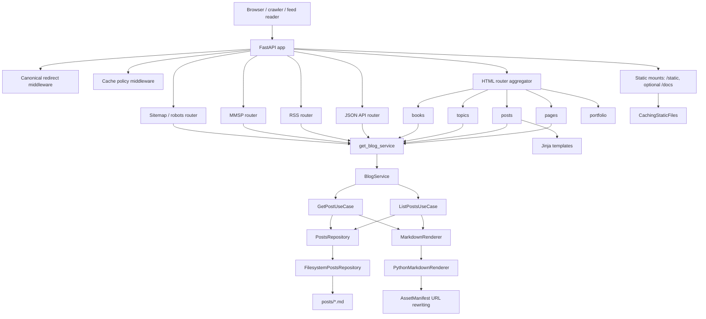

# Architecture

Crank The Code is a small FastAPI application that serves a personal writing site from markdown files, with a light static asset fingerprinting pipeline in front of its CSS, JavaScript and images. There is no database and no CMS. Content is `posts/*.md` with YAML frontmatter; structure is expressed in tags on those posts.

Source references in this document name modules and symbols rather than line numbers. Line numbers rot on the first refactor and this document has been wrong that way before.

---

## Invariants

These are the properties the application is not allowed to lose. Each is held by a named test, so a change that breaks one fails the gate rather than reaching production.

| Invariant | Enforced by |
|---|---|
| Every non-local request is redirected once, permanently, to `https://www.crankthecode.com` with its path and query intact. Localhost is exempt so `uvicorn` behaves normally in development. | `test_canonical_redirect_middleware_redirects_http_apex_to_https_www`, `test_canonical_redirect_middleware_preserves_path_and_query_on_redirect`, `test_canonical_redirect_middleware_allows_localhost_without_redirect` in `tests/test_canonical_redirect_middleware.py` |
| HTML is never cached anywhere: browser, proxy or CDN. | `test_html_cache_headers_are_no_store` in `tests/test_html_pages.py` |
| Fingerprinted static assets are cached immutably for a year; a favicon never is. | `test_fingerprinted_static_assets_are_immutable_cached`, `test_favicon_is_not_cached_forever` in `tests/test_html_pages.py`; `test_caching_staticfiles_cache_headers` in `tests/test_assets_caching.py` |
| The app starts and serves on a checkout where the static build has never run. | `test_app_starts_when_the_static_build_has_not_run` in `tests/test_html_pages.py` |
| `CTC_STATIC_DIST_DIR` selects the served directory, not merely the CV lookup. | `test_cv_pdf_prefers_static_dist_when_enabled` and `test_app_starts_when_the_static_build_has_not_run` in `tests/test_html_pages.py` |
| The CV is reachable at a stable root URL regardless of which static directory is mounted. | `test_cv_pdf_is_served_from_stable_root_path` in `tests/test_html_pages.py` |
| EPUB files stay in the repository and are never downloadable, whether or not `docs/` exists. | `test_docs_epub_is_not_served`, `test_docs_directory_can_be_present_without_exposing_epub_downloads` in `tests/test_html_pages.py` |
| Every published post carries a meta description, a canonical URL and valid JSON-LD. | `test_all_posts_have_required_seo_meta_and_valid_jsonld`, `test_post_page_includes_meta_description_canonical_and_jsonld` in `tests/test_seo.py` |
| A legacy post slug still serves its content while its canonical URL points at the new slug. | `test_legacy_post_alias_serves_content_but_canonical_points_to_new_slug` in `tests/test_seo.py` |
| The sitemap lists the main pages, the posts and the topic hubs; robots.txt always names the sitemap. | `test_sitemap_lists_main_pages_and_posts`, `test_robots_txt_includes_sitemap_location` in `tests/test_seo.py`, `test_sitemap_includes_topics_and_topic_hub_pages` in `tests/test_topic_hubs.py` |
| The RSS feed excludes the Decision Architecture stream and the hidden special pages. | `test_rss_feed_excludes_special_pages` in `tests/test_rss_feed.py` |
| The MMSP feed excludes the same hidden and special posts and emits absolute URLs. | `test_mmsp_excludes_hidden_and_special_posts`, `test_mmsp_items_have_absolute_urls` in `tests/test_mmsp_feed.py` |
| `/portfolio` and its legacy section URLs redirect permanently to ernster.dev. | `test_portfolio_redirects_permanently_to_ernster_dev`, `test_portfolio_redirect_covers_legacy_section_urls` in `tests/test_portfolio_page.py` |
| Filtering by `cat` and `layer` together is an AND; the legacy `q=cat:<Label>` deeplink still works. | `test_posts_index_supports_cat_and_layer_params_and_filters_with_and_semantics`, `test_legacy_q_cat_deeplink_still_filters_posts` in `tests/test_layer_navigation.py` |
| Layer slugs normalise consistently wherever they are parsed; CTO stays an acronym when humanised. | `test_layer_slug_normalization_collapses_spaces_underscores_and_punctuation` in `tests/test_layer_navigation.py`, `test_humanize_layer_slug_preserves_cto_acronym` in `tests/test_layer_extraction_helpers.py` |
| A post with malformed frontmatter degrades the page instead of failing the request. | `test_load_about_html_fail_open_for_missing_post_and_exception` in `tests/test_html_router_coverage.py`, `test_homepage_leadership_missing_posts_is_tolerated` in `tests/test_coverage_boost.py` |
| `python main.py` remains a working entrypoint. | `test_root_main_module_can_run_as_script_without_starting_server` in `tests/test_entrypoints.py` |

The whole suite is the gate: `pytest.ini` carries `--cov-fail-under=100` against `app/`, so no branch reaches production unexercised. `.github/workflows/checks.yml` runs black, flake8, ruff and pytest on every push and pull request, building the fingerprinted assets first so the tested state is the state that ships.

---

## What runs in production

Render starts Uvicorn against the repo-root shim (`render.yaml` to `main.py`). `main.py` exists only so `uvicorn main:app` and `python main.py` keep working; it re-exports the real application.

The real ASGI app and its factory are `create_app()` and the module-level `app` in `app/main.py`.

Two runtime policies are defined inside the factory:

* **Canonical host and scheme.** `enforce_canonical_host_and_scheme` issues a single 301 to `https://<canonical host>` for any non-local request that does not already match, preserving path and query. The host comes from `CTC_CANONICAL_HOST` and defaults to `www.crankthecode.com`. `127.0.0.1` and `localhost` are bypassed.
* **Cache policy.** `_CachePolicyMiddleware` is pure ASGI: it intercepts `http.response.start` and sets headers before any bytes reach the wire, which is more reliable than a `call_next` middleware whose header mutations some Starlette versions drop. HTML becomes `no-store` across browser, CDN and surrogate layers; RSS, XML, JSON and plain text become `no-cache, must-revalidate` when they carry no policy of their own; everything else is left to `CachingStaticFiles`.

---

## Layering

The codebase uses a light ports and adapters flavour. It is a deliberate relaxation of strict clean architecture, appropriate for a server-rendered site.

* **Presentation**: FastAPI routers for HTML, JSON API, RSS, MMSP and sitemap/robots, plus view-model modules that assemble template context.
* **Application**: a service facade, `BlogService`, over two use cases.
* **Domain**: typed dataclasses, tag parsing and normalisation plus the taxonomy constants. Stdlib only, no framework imports.
* **Infrastructure and adapters**: the filesystem posts repository, the markdown rendering strategy and the static asset pipeline.

Key types:

| Role | Where |
|---|---|
| Service facade | `BlogService` in `app/services/blog_service.py` |
| Use cases | `ListPostsUseCase.execute()` in `app/usecases/list_posts.py`, `GetPostUseCase.execute()` in `app/usecases/get_post.py` |
| Domain models | `MarkdownPost`, `PostSummary`, `PostDetail` in `app/domain/models.py` |
| Ports | `PostsRepository` in `app/ports/posts_repository.py`, `MarkdownRenderer` in `app/ports/markdown_renderer.py`, `AssetUrls` in `app/ports/asset_urls.py` |
| Adapters | `FilesystemPostsRepository` in `app/adapters/filesystem_posts_repository.py`, `PythonMarkdownRenderer` in `app/adapters/markdown_python_renderer.py`, `AssetManifest` in `app/assets/manifest.py` |
| Composition root | `get_blog_service()` in `app/http/deps.py` |

The direction of these dependencies is held by a source scan rather than by
habit, because a behavioural suite cannot see an import that crosses a boundary:

| Invariant | Enforced by |
|---|---|
| `app/domain` imports nothing outside the standard library. | `test_domain_imports_nothing_outside_the_standard_library` in `tests/test_architecture_boundaries.py` |
| A use case imports only `app.domain` and `app.ports`, never a concrete adapter. | `test_usecases_import_only_domain_and_ports` in `tests/test_architecture_boundaries.py` |
| A port never depends on `app.adapters`, `app.http` or `app.assets`. | `test_ports_do_not_depend_on_adapters_http_or_assets` in `tests/test_architecture_boundaries.py` |
| The scan actually reaches those three layers, so renaming one cannot turn the assertions into vacuous passes. | `test_the_scan_reaches_the_layers_it_claims_to_cover` in `tests/test_architecture_boundaries.py` |

`AssetManifest` satisfies `AssetUrls` structurally, so the use cases resolve
fingerprinted asset URLs without knowing whether fingerprinting is configured at
all. A test supplies `AssetManifest(mapping={})` and gets identity behaviour.

```mermaid
flowchart TD
  U[Browser / crawler / feed reader] --> APP[FastAPI app]

  APP --> M1[Canonical redirect middleware]
  APP --> M2[Cache policy middleware]

  APP --> HTML[HTML router aggregator]
  APP --> API[JSON API router]
  APP --> RSS[RSS router]
  APP --> MMSP[MMSP router]
  APP --> SEO[Sitemap / robots router]

  HTML --> PAGES[pages]
  HTML --> POSTS[posts]
  HTML --> TOPICS[topics]
  HTML --> BOOKS[books]
  HTML --> PORT[portfolio]

  PAGES --> DI[get_blog_service]
  POSTS --> DI
  TOPICS --> DI
  BOOKS --> DI
  API --> DI
  RSS --> DI
  MMSP --> DI
  SEO --> DI

  DI --> SVC[BlogService]
  SVC --> LUC[ListPostsUseCase]
  SVC --> GUC[GetPostUseCase]

  LUC --> REP[PostsRepository]
  GUC --> REP
  LUC --> MR[MarkdownRenderer]
  GUC --> MR

  REP --> FS[FilesystemPostsRepository]
  MR --> REND[PythonMarkdownRenderer]

  FS --> MD[posts/*.md]
  POSTS --> TPL[Jinja templates]
  APP --> STA[Static mounts: /static, optional /docs]
  STA --> CFS[CachingStaticFiles]
  REND --> ASM[AssetManifest URL rewriting]
```

### Routers

`app/http/routers/html.py` is an aggregator only. It defines no routes; it includes the sub-routers so `app/main.py` can keep importing a single object.

| Module | Routes |
|---|---|
| `pages.py` | `/`, `/about`, `/explore` and the legacy redirects (`/about-me`, `/about/oliver-ernster`, `/start-here`, `/governance`, `/help`, `/battlestation`) |
| `posts.py` | `/posts` listing and `/posts/{slug}` detail |
| `essays.py` | `/essays` (the curated essay set) and `/build-log` (the dated record) |
| `topics.py` | `/patterns`, `/patterns/{layer}` |
| `books.py` | `/books` |
| `portfolio.py` | `/portfolio`, a 301 to ernster.dev |
| `api.py` | `/api/posts`, `/api/posts/{slug}`, `/api/posts/{slug}/meta` |
| `rss.py` | `/rss.xml` |
| `mmsp.py` | `/.well-known/mmsp.json` |
| `sitemap.py` | `/sitemap.xml`, `/robots.txt` |

Template context assembly lives beside them in `app/http/view_models/`: `context.py` for the shared base context, `sidebar.py` for navigation state and the posts view model, `posts.py` for display helpers and grouping, `leadership.py` for the hub listings.

---

## Request flows

### Homepage

`homepage()` in `app/http/routers/pages.py` renders `templates/index.html`. It is deliberately a gateway rather than a post listing: a featured call to action for the thesis post `posts/what-is-decision-architecture.md`, then two cards routing into the two Decision Architecture ecosystems. JSON-LD is built server-side and emitted through slots in `templates/base.html`.

### Posts index

`posts_index()` in `app/http/routers/posts.py` remains the search and archive surface. The old `view=writing` links 301 to `/essays` (and the Blog variant to `/build-log`) via the redirect table; the archive view is still selected by the `view` query parameter and normalised by `normalize_posts_view()` in `app/http/view_models/sidebar.py`.

Filtering accepts `cat=<Label>` and `layer=<slug>` and applies them together as an AND. The older `q=cat:<Label>` deeplink form is still honoured; the older `exclude_blog` parameter maps onto the view model through `posts_view_from_legacy_exclude_blog()`.

### Post detail

`read_post()` in `app/http/routers/posts.py` delegates content to `GetPostUseCase.execute()`. The canonical URL preserves the query string so a filtered listing links back correctly (`canonical_url_for_request()` in `app/http/seo.py`). The meta description is built from frontmatter, blurb first with the one-liner as fallback (`build_meta_description()`).

### Essays, Build Log and Patterns

`/essays` (in `app/http/routers/essays.py`) is the curated Decision Architecture essay set. Its grouping is editorial, fixed in `app/domain/essays.py`, not derived from tags. `/build-log` lists every dated post that is not an essay, a pattern or a site page.

Patterns keep their hub system in `app/http/routers/topics.py`: `/patterns` as the gateway and `/patterns/<layer>` per layer, driven by `cat:decision-architecture-patterns`.

The former `/decision-architecture`, `/topics` and `/topics/<layer>` surfaces are retired. Their URLs, the culled essay slugs and the old `/posts` view query strings all 301 through one table in `app/http/redirects.py`, checked by a single middleware in `app/main.py`.

### Feeds and SEO surfaces

* RSS (`rss_feed()`): excludes the Decision Architecture stream via `_is_leadership_post()` and the hidden special pages via `_is_hidden_special_post()`, wraps HTML bodies in CDATA and carries Media RSS thumbnails, backfilling an image from older posts when the newest ones have none.
* MMSP (`mmsp_feed()`): a machine-readable subscription manifest at `/.well-known/mmsp.json`, applying the same exclusions and emitting absolute URLs.
* Sitemap and robots (`sitemap_xml()`, `robots_txt()`): robots.txt is served from the static file when present and falls back to a generated body; the sitemap line is appended either way.

---

## Content model

Posts are `posts/*.md` with YAML frontmatter, loaded by `FilesystemPostsRepository`. The storage model is `MarkdownPost`. Beyond `title`, `date` and `tags` it supports:

| Field | Purpose |
|---|---|
| `blurb` | Meta description and list UI |
| `one_liner` | Social preview snippet; also the meta description fallback |
| `image` | Explicit cover image; also the default thumbnail |
| `thumb_image` | Tile thumbnail, falling back to `image` |
| `emoji` | Visual thumbnail where there is no image |
| `social_image` | OpenGraph and Twitter image, falling back to the cover |
| `extra_images` | Gallery and screenshot images |

Normalisation rules:

* Tags normalise to a list of strings (`_normalize_tags()`).
* Dates normalise to the sortable string form `YYYY-MM-DD HH:MM` (`_normalize_published_at()`).
* Files named `blog*.md` are always discoverable under `cat:Blog` even without the tag, as a safety net.

Rendering decisions are a use case concern, so the resulting HTML shape stays testable and consistent:

* `ListPostsUseCase.execute()` extracts the first paragraph as a summary and handles cover and thumbnail selection and stripping.
* `GetPostUseCase.execute()` strips an explicit cover image paragraph near the top, protects an author-written Screenshots section and can inject a controlled one from `extra_images`.

### Taxonomy

Navigation is driven by two tag conventions, not by hardcoded lists:

* `cat:<Label>` for the primary category. The canonical labels are in `app/domain/taxonomy.py`.
* `layer:<slug>` for grouping into layers within both hub ecosystems. Slug normalisation and humanisation are shared by every consumer through `normalize_layer_slug()` and `humanize_layer_slug()` in `app/domain/tags.py`.

Sidebar navigation is the deliberate exception: it is explicit in `templates/base.html` rather than derived from tags, so the order of the top-level entries is an editorial decision rather than an emergent one.

---

## Templates, static assets and caching

The Jinja environment is created in the factory and stored on `fastapi_app.state.templates`, with `asset_url()` exposed as a global so templates can emit fingerprinted URLs. `templates/base.html` owns the SEO slots, the JSON-LD slots and the sidebar.

### Serving

Static files go through `FallbackStaticFiles`, a subclass of `CachingStaticFiles`:

* A fingerprinted filename gets `public, max-age=31536000, immutable`.
* Anything else gets `no-store`, which is the safe answer when the URL is not content-addressed.
* A 404 in the primary directory falls through to the fallback directory rather than failing.

`/docs` is mounted only if the directory exists, so `/docs/...` 404s otherwise. EPUB files are kept in the repository but are not published there.

### The fingerprinting pipeline

`build_static_dist()` in `app/assets/build_static.py` copies every file in `static/` to `static_dist/` under its original name, emits a fingerprinted copy alongside it and writes `manifest.json` mapping logical relative path to fingerprinted relative path. Render runs it as a build command; CI runs it before pytest.

`AssetManifest` in `app/assets/manifest.py` loads that map, resolves `asset_url()` lookups for templates and rewrites `/static/...` URLs inside rendered HTML.

Which directory is served is decided at startup in `create_app()`:

| Variable | Default | Effect |
|---|---|---|
| `CTC_USE_STATIC_DIST` | unset | When truthy, serve the fingerprinted build instead of `static/` |
| `CTC_STATIC_DIST_DIR` | `static_dist` | Which directory that is. It steers the mount as well as the CV lookup. |
| `CTC_STATIC_MANIFEST_PATH` | `static_dist/manifest.json` | Where the manifest is read from |
| `CTC_CANONICAL_HOST` | `www.crankthecode.com` | The host the redirect middleware normalises to |

If the selected directory does not exist, the mount falls back to `static/`. Mounting a missing directory raises at startup; `static_dist/` is gitignored build output, so without that fallback a clean checkout could not start.
